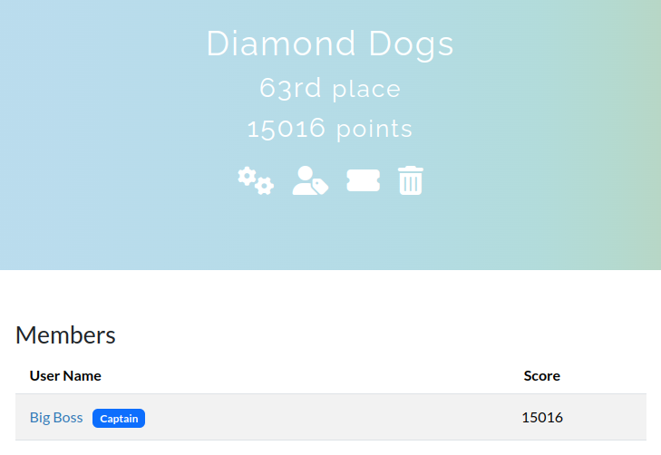
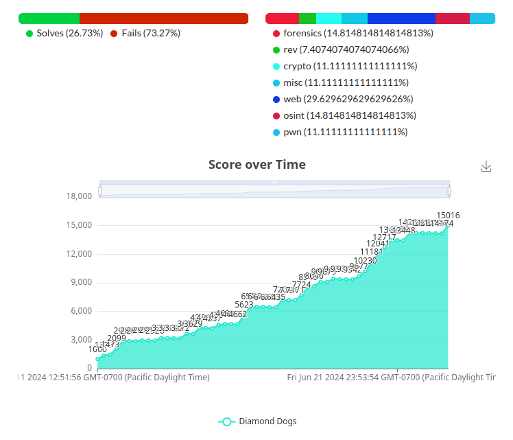

# jellyCTF-writeups

Writeups for all the challenges I managed to complete for [jellyCTF](https://jellyc.tf).

## Info

From the jellyCTF homepage:

> Welcome to jellyCTF! This is a beginner to intermediate targeted [jeopardy](https://ctftime.org/ctf-wtf/) style [CTF](https://en.wikipedia.org/wiki/Capture_the_flag_(cybersecurity)) themed around the Virtual YouTuber [Jelly Hoshiumi](https://www.youtube.com/@JellyHoshiumi), intended to introduce her ~~awatistic~~ awesome audience to security challenges.

## My Experience

I did these challenges solo, earning 15,016 points and reaching 63rd place out of 567 teams.

This was the first CTF I've ever participated in, but I managed to solve more challenges than expected and I learned quite a bit as well.

## Links

CTF website: https://jellyc.tf

My team: https://jellyc.tf/teams/373

Offical writeups and source code: https://github.com/jellyctf/challenges