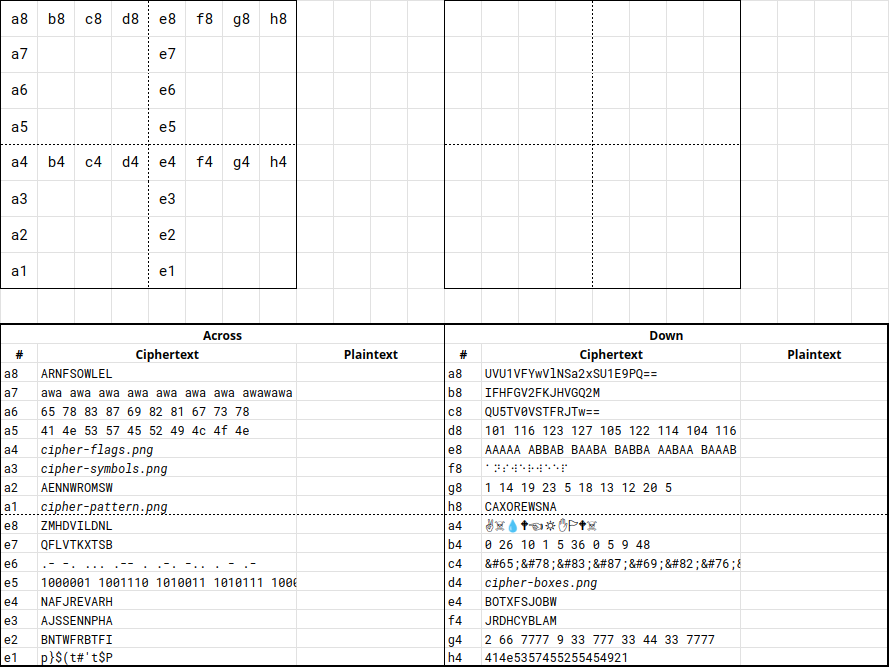
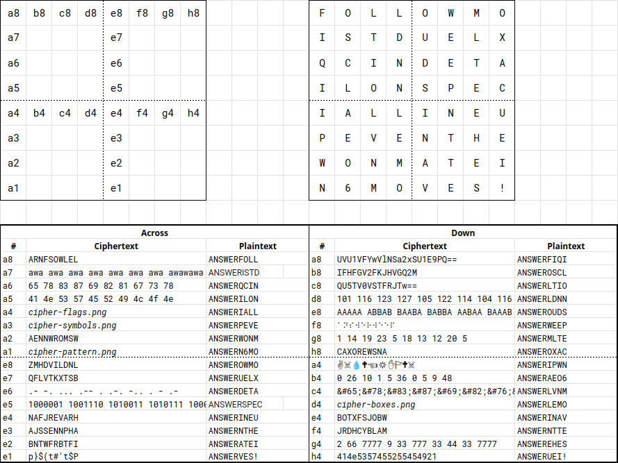

# cipher_check

## Difficulty

Medium

## Points Earned 

766

## Description

> Let's see if you can decode some common ciphers! Decoding ciphers may be tricky, especially when you're new to CTFs, but...
>
> **jellyCTF{ _ _ _ _ _ _ _ _ _ _ _ _ } (12 characters)**
> 
> ---
> 
> **15 point hint:** I have the board completed. Where is the flag?
> 
> **20 point hint:** I do not have the board completed. May I have a list of ciphers used to complete the board?
> 
> Author: Meow Mix
> 
> ---
> 
> **Note:** The .xlsx file is not required to complete this challenge but it's highly recommended to upload it to Google Drive to collaborate with your team!



## Solution

I was able to solve most of these ciphers by plugging them into [CacheSleuth](https://www.cachesleuth.com/multidecoder/). There were a couple that I could not decode, which is when I turned to hint 2.

### Hint 2

> Here is a list of ciphers used for this challenge!
> 
> [...]
>
> - Vigenere-awawawawawa
> - Vigenere-babababababa
> - Vigenere-jellyhoshiumi

This is the solved crossword:



I didn't really know where to go from here so I unlocked hint 1.

### Hint 1

> Have you noticed the crossword grid is 8x8?
> 
> Find the duel and follow the moves!

Reading the crossword row by row gives us this:

```md
# each row
FOLLOWMO ISTDUELX QCINDETA ILONSPEC IALLINEU PEVENTHE WONMATEI N6MOVES!

# concatenated
FOLLOWMOISTDUELXQCINDETAILONSPECIALLINEUPEVENTHEWONMATEIN6MOVES!

# parsed into words
FOLLOW MOIST DUEL XQC IN DETAIL ON SPECIAL LINE UP EVENT HE WON MATE IN 6 MOVES!
```

"MOIST DUEL XQC." This made me think of the [infamous chess match between MoistCr1tikal and xQc](https://www.chess.com/news/view/chesscom-pogchamps-xqc-moistcr1tikal), where he did indeed checkmate in 6 moves.

These are the moves in order:

```
e4 e5 f3 c6 d4 d4 d4 c5 c3 f6 c6 f2
```

I noticed that these moves corresponded with positions on the crossword. This is what we get when we look up the characters:

```
e4 e5 f3 c6 d4 d4 d4 c5 c3 f6 c6 f2
i  s  t  i  l  l  l  o  v  e  i  t
```

## Flag

`jellyCTF{istillloveit}`