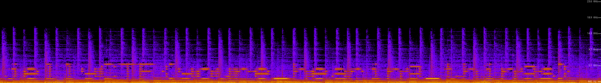

# alien_transmission

## Difficulty

Easy

## Points Earned 

373

## Description

> Note: Volume warning
>
> My radio picked up some weird interference - I'm sure it's aliens but nobody believes me!!!
> 
> Author: Sheepiroo

[`alien_transmission.mp3`](./media/alien_transmission.mp3)

["alien_transmission audio"](https://github.com/OtherAndrew/jellyCTF-writeups/assets/103388958/7c7fa22f-d557-4a9c-a69c-778ac3ceaae8)

## Solution

I've watched enough spooky YouTube videos to know that there's probably a secret message hiding in the audio waveform. Plugging the mp3 file into a [spectrum analyzer](https://academo.org/demos/spectrum-analyzer/) we get this:

## Flag

`jellyCTF{youre_hearing_things}`
