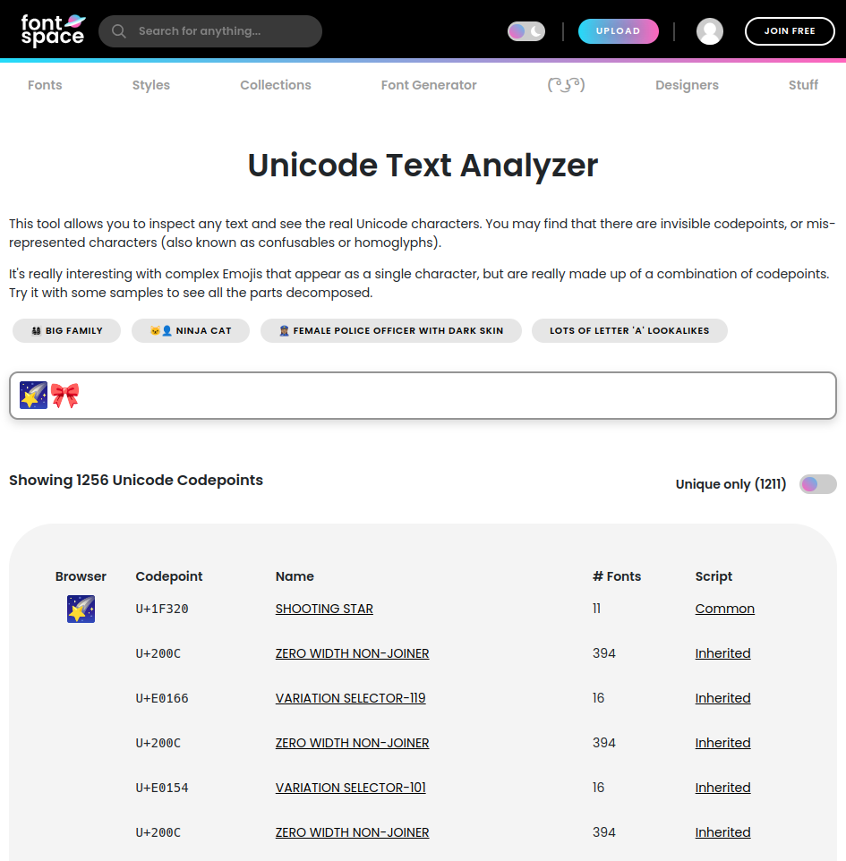

# oshi_mark

## Difficulty

Hard

## Points Earned 

951

## Description

> 🌠‌󠅦‌󠅔‌󠅛‌󠅛‌󠄛‌󠄏‌󠅦‌󠅔‌󠅛‌󠅛‌󠄛‌󠄏‌󠅦‌󠅔‌󠅛‌󠅛‌󠄛‌󠄏‌󠅛‌󠅞‌󠅞‌󠅚‌󠄏‌󠅦‌󠅗‌󠅞‌󠄏‌󠅕‌󠅘‌󠅝‌󠅐‌󠅛‌󠅛‌󠅨‌󠄏‌󠅓‌󠅔‌󠅒‌󠅞‌󠅓‌󠅔‌󠅓‌󠄏‌󠅜‌󠅨‌󠄏‌󠅢‌󠅔‌󠅒‌󠅡‌󠅔‌󠅣‌󠄏‌󠅞‌󠅢‌󠅗‌󠅘‌󠄏‌󠅜‌󠅐‌󠅡‌󠅚‌󠄏‌󠅜‌󠅔‌󠅢‌󠅢‌󠅐‌󠅖‌󠅔‌󠄐‌󠄏‌󠅒‌󠅞‌󠅝‌󠅖‌󠅡‌󠅐‌󠅣‌󠅤‌󠅛‌󠅐‌󠅣‌󠅘‌󠅞‌󠅝‌󠅢‌󠄏‌󠅞‌󠅝‌󠄏‌󠅦‌󠅐‌󠅢‌󠅣‌󠅘‌󠅝‌󠅖‌󠄏‌󠅒‌󠅞‌󠅤‌󠅝‌󠅣‌󠅛‌󠅔‌󠅢‌󠅢‌󠄏‌󠅗‌󠅞‌󠅤‌󠅡‌󠅢‌󠄏‌󠄗‌󠅐‌󠅝‌󠅓‌󠄏‌󠅟‌󠅡‌󠅞‌󠅑‌󠅐‌󠅑‌󠅛‌󠅨‌󠄏‌󠅑‌󠅡‌󠅐‌󠅘‌󠅝‌󠄏‌󠅒‌󠅔‌󠅛‌󠅛‌󠅢‌󠄘‌󠄏‌󠅕‌󠅘‌󠅖‌󠅤‌󠅡‌󠅘‌󠅝‌󠅖‌󠄏‌󠅞‌󠅤‌󠅣‌󠄏‌󠅣‌󠅗‌󠅐‌󠅣‌󠄏‌󠄑‌󠅐‌󠅦‌󠅐‌󠅦‌󠅐‌󠅦‌󠅐‌󠄑‌󠄏‌󠅜‌󠅔‌󠅐‌󠅝‌󠅢‌󠄏‌󠄑‌󠅘‌󠄏‌󠅛‌󠅞‌󠅥‌󠅔‌󠄏‌󠅨‌󠅞‌󠅤‌󠄐‌󠄑‌󠄏‌󠅜‌󠅐‌󠅨‌󠅑‌󠅔‌󠄏‌󠅨‌󠅞‌󠅤‌󠄖‌󠅥‌󠅔‌󠄏‌󠅕‌󠅘‌󠅝‌󠅐‌󠅛‌󠅛‌󠅨‌󠄏‌󠅕‌󠅞‌󠅤‌󠅝‌󠅓‌󠄏‌󠅐‌󠄏‌󠅤‌󠅢‌󠅔‌󠄏‌󠅕‌󠅞‌󠅡‌󠄏‌󠅐‌󠅛‌󠅛‌󠄏‌󠅣‌󠅗‌󠅐‌󠅣‌󠄏‌󠅝‌󠅔‌󠅡‌󠅓‌󠅨‌󠄏‌󠅚‌󠅝‌󠅞‌󠅦‌󠅛‌󠅔‌󠅓‌󠅖‌󠅔‌󠄏‌󠅨‌󠅞‌󠅤‌󠄖‌󠅥‌󠅔‌󠄏‌󠅐‌󠅒‌󠅒‌󠅤‌󠅜‌󠅤‌󠅛‌󠅐‌󠅣‌󠅔‌󠅓‌󠄏‌󠅞‌󠅥‌󠅔‌󠅡‌󠄏‌󠅣‌󠅗‌󠅔‌󠄏‌󠅨‌󠅔‌󠅐‌󠅡‌󠅢‌󠄝‌󠄏‌󠅐‌󠅝‌󠅓‌󠄏‌󠅛‌󠅔‌󠅣‌󠄖‌󠅢‌󠄏‌󠅑‌󠅔‌󠄏‌󠅗‌󠅞‌󠅝‌󠅔‌󠅢‌󠅣‌󠄛‌󠄏‌󠅨‌󠅞‌󠅤‌󠄏‌󠅟‌󠅡‌󠅞‌󠅑‌󠅐‌󠅑‌󠅛‌󠅨‌󠄏‌󠅒‌󠅞‌󠅤‌󠅛‌󠅓‌󠅝‌󠄖‌󠅣‌󠄏‌󠅔‌󠅥‌󠅔‌󠅝‌󠄏‌󠅕‌󠅘‌󠅖‌󠅤‌󠅡‌󠅔‌󠄏‌󠅞‌󠅤‌󠅣‌󠄏‌󠅣‌󠅗‌󠅔‌󠄏‌󠅜‌󠅔‌󠅢‌󠅢‌󠅐‌󠅖‌󠅔‌󠄏‌󠅦‌󠅘‌󠅣‌󠅗‌󠅞‌󠅤‌󠅣‌󠄏‌󠅡‌󠅔‌󠅛‌󠅨‌󠅘‌󠅝‌󠅖‌󠄏‌󠅞‌󠅝‌󠄏‌󠅐‌󠄏‌󠅢‌󠅘‌󠅛‌󠅛‌󠅨‌󠄏‌󠅤‌󠅝‌󠅘‌󠅒‌󠅞‌󠅓‌󠅔‌󠄏‌󠅓‌󠅔‌󠅒‌󠅞‌󠅓‌󠅘‌󠅝‌󠅖‌󠄏‌󠅢‌󠅘‌󠅣‌󠅔‌󠄏‌󠅨‌󠅞‌󠅤‌󠄏‌󠅕‌󠅞‌󠅤‌󠅝‌󠅓‌󠄏‌󠅤‌󠅢‌󠅘‌󠅝‌󠅖‌󠄏‌󠅗‌󠅘‌󠅝‌󠅣‌󠅢‌󠄝‌󠄏‌󠅓‌󠅞‌󠅝‌󠄖‌󠅣‌󠄏‌󠅦‌󠅞‌󠅡‌󠅡‌󠅨‌󠄏‌󠅣‌󠅗‌󠅞‌󠅤‌󠅖‌󠅗‌󠄛‌󠄏‌󠅘‌󠄏‌󠅦‌󠅞‌󠅝‌󠄖‌󠅣‌󠄏‌󠅣‌󠅔‌󠅛‌󠅛‌󠄏‌󠅐‌󠅝‌󠅨‌󠅞‌󠅝‌󠅔‌󠄐‌󠄏‌󠅗‌󠅞‌󠅦‌󠄏‌󠅐‌󠅑‌󠅞‌󠅤‌󠅣‌󠄏‌󠅣‌󠅗‌󠅘‌󠅢‌󠄮‌󠄏‌󠅛‌󠅔‌󠅣‌󠄖‌󠅢‌󠄏‌󠅖‌󠅘‌󠅥‌󠅔‌󠄏‌󠅨‌󠅞‌󠅤‌󠄏‌󠅐‌󠄏‌󠅟‌󠅡‌󠅘‌󠅩‌󠅔‌󠄏‌󠅕‌󠅞‌󠅡‌󠄏‌󠅨‌󠅞‌󠅤‌󠅡‌󠄏‌󠅔‌󠅕‌󠅕‌󠅞‌󠅡‌󠅣‌󠅢‌󠄝‌󠄏‌󠅗‌󠅞‌󠅦‌󠄏‌󠅐‌󠅑‌󠅞‌󠅤‌󠅣‌󠄝‌󠄝‌󠄝‌󠄏‌󠅙‌󠅔‌󠅛‌󠅛‌󠅨‌󠄲‌󠅃‌󠄵‌󠅪‌󠅐‌󠅎‌󠅒‌󠅤‌󠅣‌󠄢‌󠅎‌󠅐‌󠅛‌󠅘‌󠅒‌󠄢‌󠅎‌󠅗‌󠅤‌󠅖‌󠅖‌󠄣‌󠅑‌󠅛‌󠄢‌󠅎‌󠅟‌󠅛‌󠅤‌󠅢‌󠅗‌󠄠‌󠄢‌󠅬‌󠄐‌󠄏‌󠅐‌󠅦‌󠅐‌󠅦‌󠅐‌󠅦‌󠅐‌󠅦‌󠅐‌󠅦‌󠅐‌󠅦‌󠅐‌󠅦‌󠅐‌󠄐‌󠄏‌󠅘‌󠅣‌󠄖‌󠅢‌󠄏‌󠅒‌󠅤‌󠅣‌󠅔‌󠄏‌󠅗‌󠅞‌󠅦‌󠄏‌󠅝‌󠅔‌󠅡‌󠅓‌󠅨‌󠄏‌󠅨‌󠅞‌󠅤‌󠄏‌󠅐‌󠅡‌󠅔‌󠄝🎀
> 
> Author: Meow Mix

## Solution

I unlocked the hint for this one:

> awawa! you're using a hint, how cute.
>
> well what is an oshi mark? a unique code!
> 
> oh, what's the key? well i pulled it out of my ass. i call it my ass-key.

Not much help but it does give me some clues.

When I copied and pasted the emojis into a text editor, I noticed some strange spacing between the emojis.


I Googled "hidden character CTF" and came to [this blog](https://captainnoob.medium.com/zero-width-space-steganography-zwsp-ctf-92e1c414c378), which described how to print hidden characters with Python.


I tried seeing if the number of hidden characters was meaningful. The hint mentioned ASCII so I tried the ASCII code for the number of hidden chars, as well as the character itself. Neither worked. 

I noticed however that when I took the above Python output and pasted it into a text editor, not all the hidden characters were the same. There were too many different types to be a binary encoding, and I exhausted every letter of the alphabet with find and replace.


While I was doing more research on this problem, I came across [this blog](https://reese.dev/codemash2019-ctf-solutions/#ghost-text) that mentioned using [FontSpace's Unicode Analyzer](https://www.fontspace.com/unicode/analyzer) to look at hidden characters. I tried it myself and got some interesting results:



It seems as though there's a bunch of variation selectors seperated by zero width non-joiners. I thought the variation selector numbers were meaningful, and when I mapped them to ASCII characters, they started to form words!

I copy/pasted the website results into a text file, and wrote a script to take the variation selector number and convert it into an ASCII character.

```js
// just the important part
const str = [];
for (const line of file) {
    if (line.length > 1) {
        const asciiCode = line.split("-")[1]
                              .split("\t")[0];
        str.push(String.fromCharCode(asciiCode));
    }
}
return str.join("");
```
After running the script I got this:


## Flag

`jellyCTF{a_cut3_alic3_hugg4bl3_plush13}`