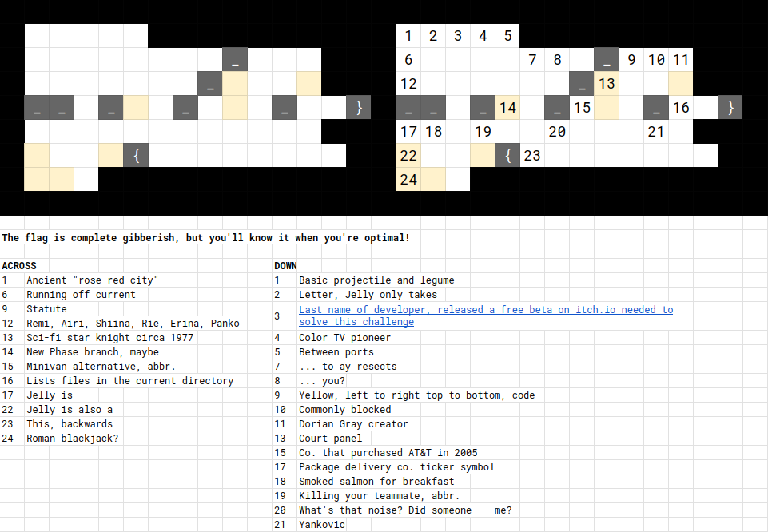
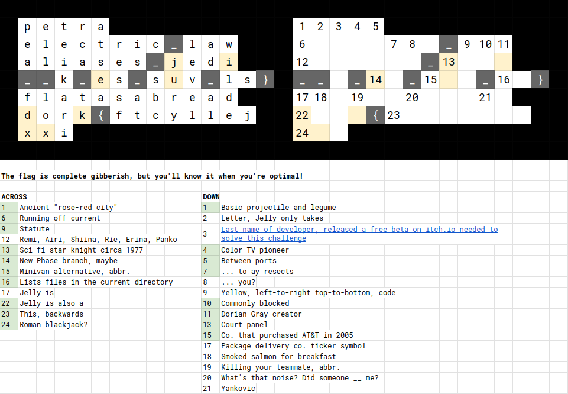
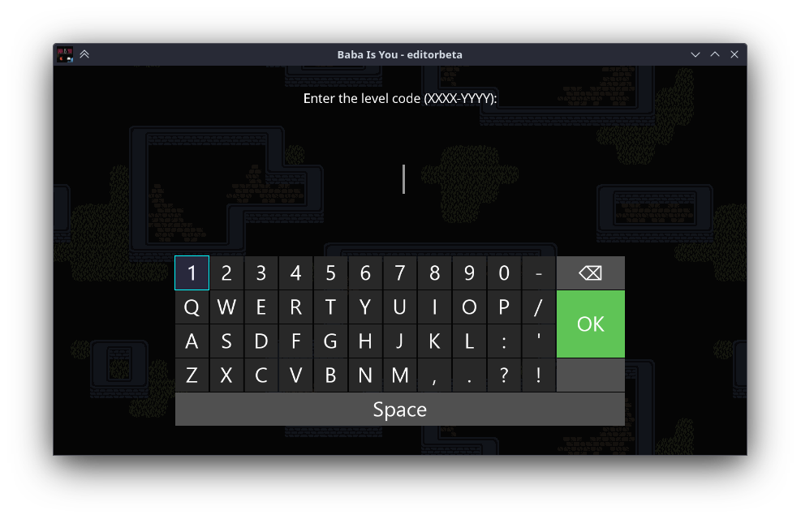
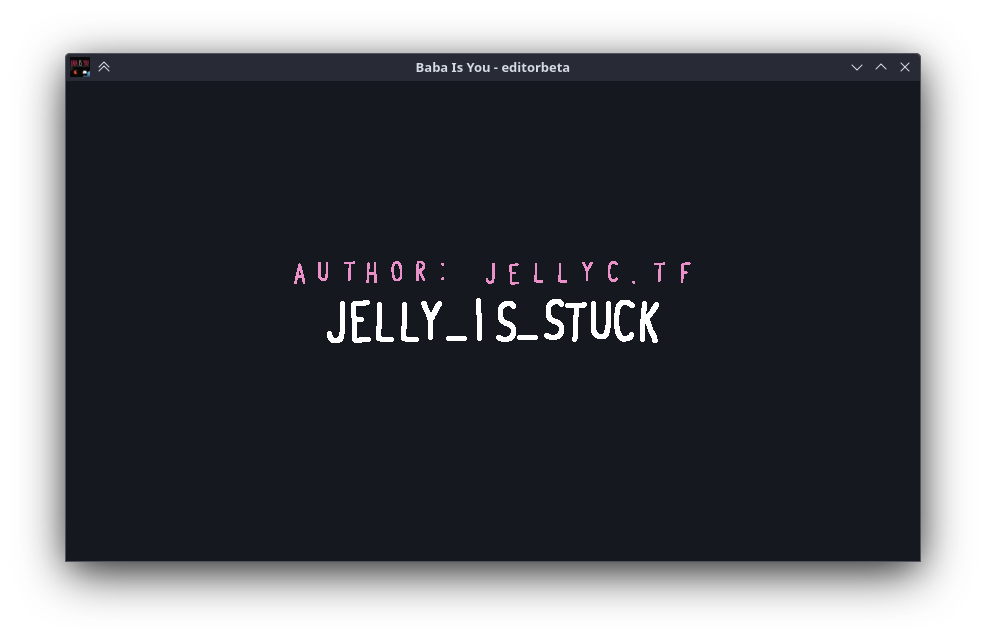
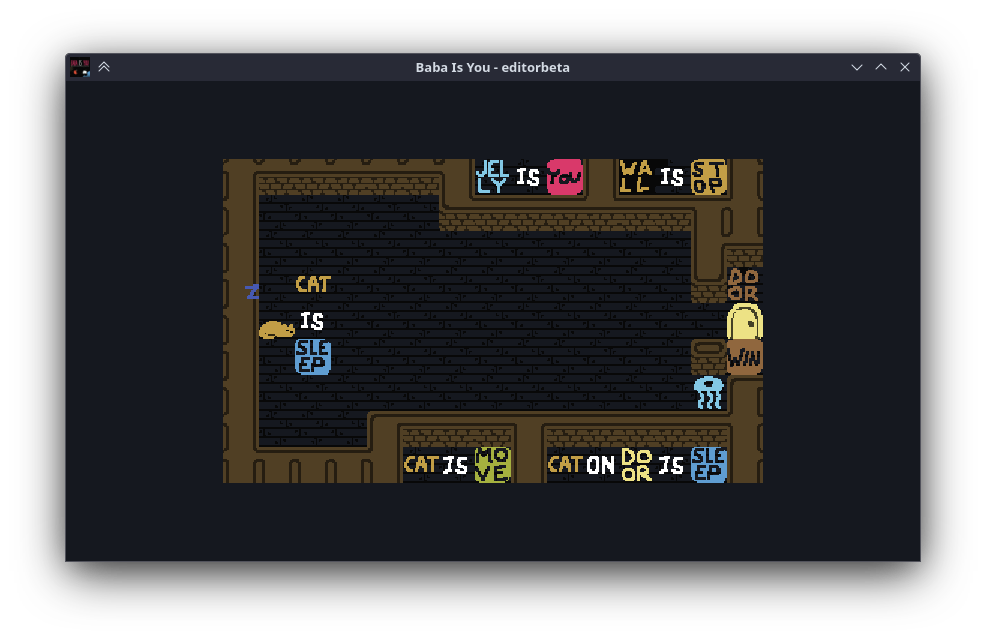

# is_jelly_stuck

## Difficulty

Medium

## Points Earned 

961

## Description

> Man, I don't know anything about computers or hacking. Let's just relax with an easy crossword puzzle...
>
> **10 Point Hint:** I know what to do with the code and solved the thing it leads to. Why isn't the flag working? Where is the flag?
> 
> **15 Point Hint:** I don't know what to do with the code. What do I do with it?
>
> Author: Meow Mix
>
> ---
>
> **Note:** The .xlsx file is not required to complete this challenge but it's highly recommended to upload it to Google Drive to collaborate with your team!

## Solution

First we gotta solve the crossword.

I figured there was something going on with the yellow highlighted characters so I tried Googling it and got no useful results. Then I unlocked hint 2 for some clues.

### Hint 2

> https://hempuli.itch.io/baba-is-you-level-editor-beta
>
> If Windows Defender is giving you trouble, run the program, select "More Info", and then "Run Anyway".

I downloaded the level editor from the link and looked around. I got to this screen and realized that the highlighted characters made up a level code:

Putting in the code `jieu-dkxx`, we get this:

Solving this took a while but I eventually got it.

<video src='./media/is_jelly_stuck_baba_sol.webm'>is_jelly_stuck baba solution</video>

### Hint 1

> Hmm... the crossword grid and the level have very similar shapes. Why not try following the jelly? After all, Jelly Is You!
>
> If the flag still isn't working, there is likely a mistake in your crossword answer. Check it over!

## Flag

``