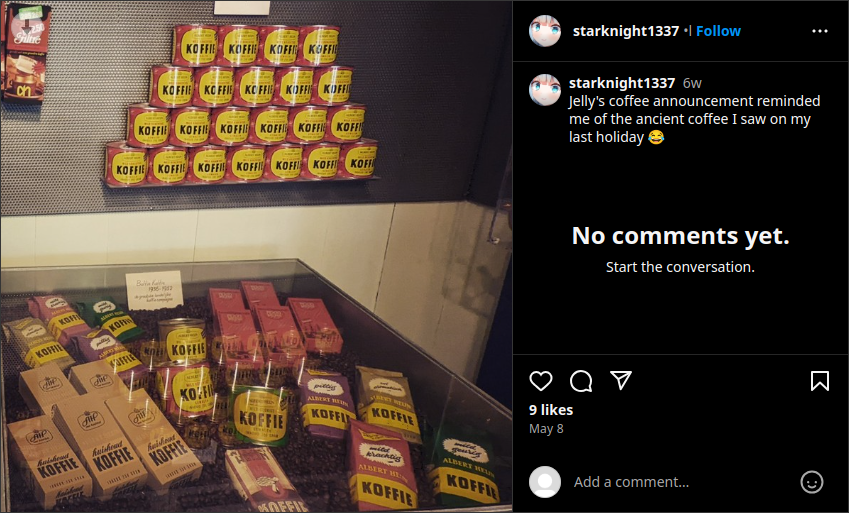
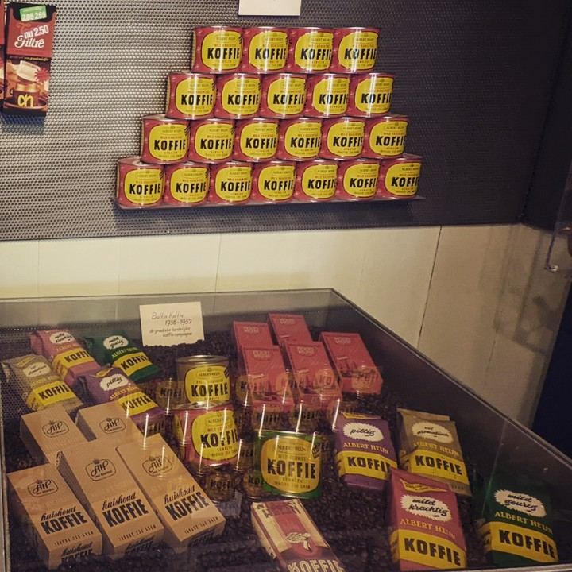
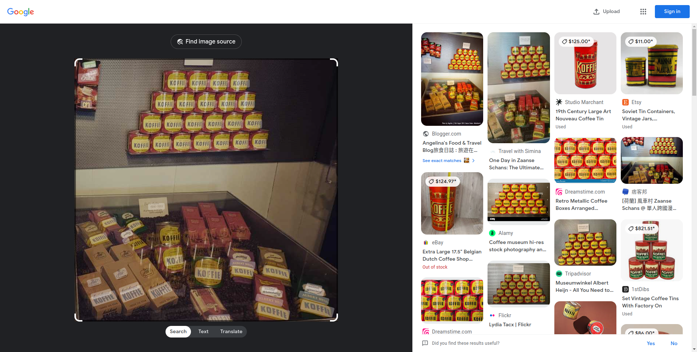

# stalknights_1

## Difficulty

Easy

## Points Earned 

100

## Description

> Stumbled across this Starknight while scrolling through Instagram. Can you figure out what neighbourhood and country this photo was taken in?
> 
> Flag format: `jellyCTF{neighbourhood_name,country}` (all lowercase)
>
> Author: Sheepiroo
>
> https://www.instagram.com/p/C6teE7Uv98I/

## Solution

[Jelly did this one on stream](https://www.youtube.com/live/QH8LKkIVHzI?t=915) but it's pretty easy.

We can inspect element on the picture to get a larger resolution image.

Doing a reverse image search with Google Lens we find that this picture was taken at the Albert Heijn Museum Shop in Zaanse Schans, Netherlands.

## Flag

`jellyCTF{zaanse_schans,netherlands}`