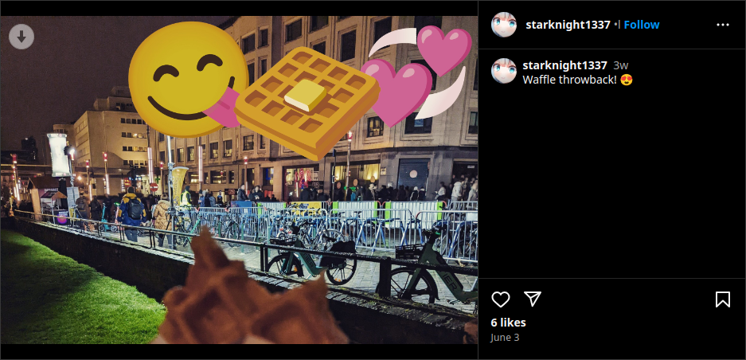
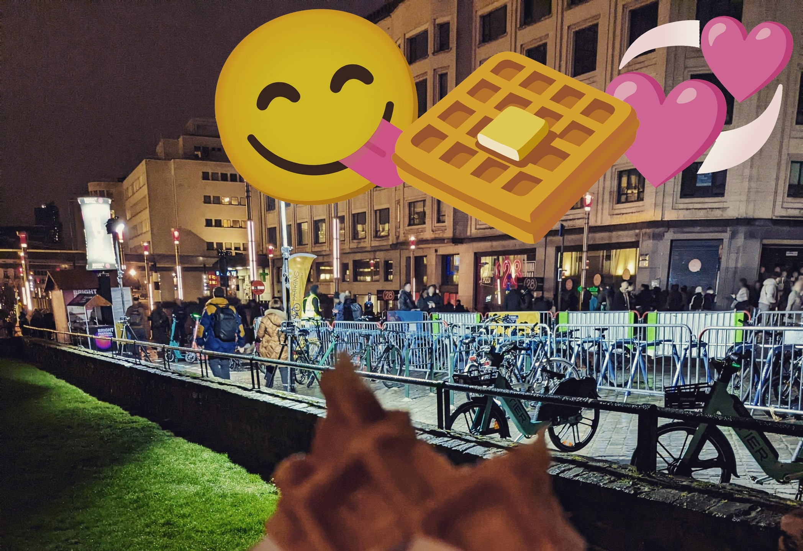
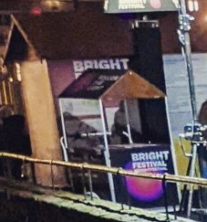
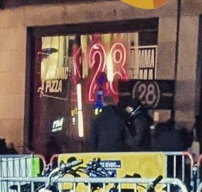
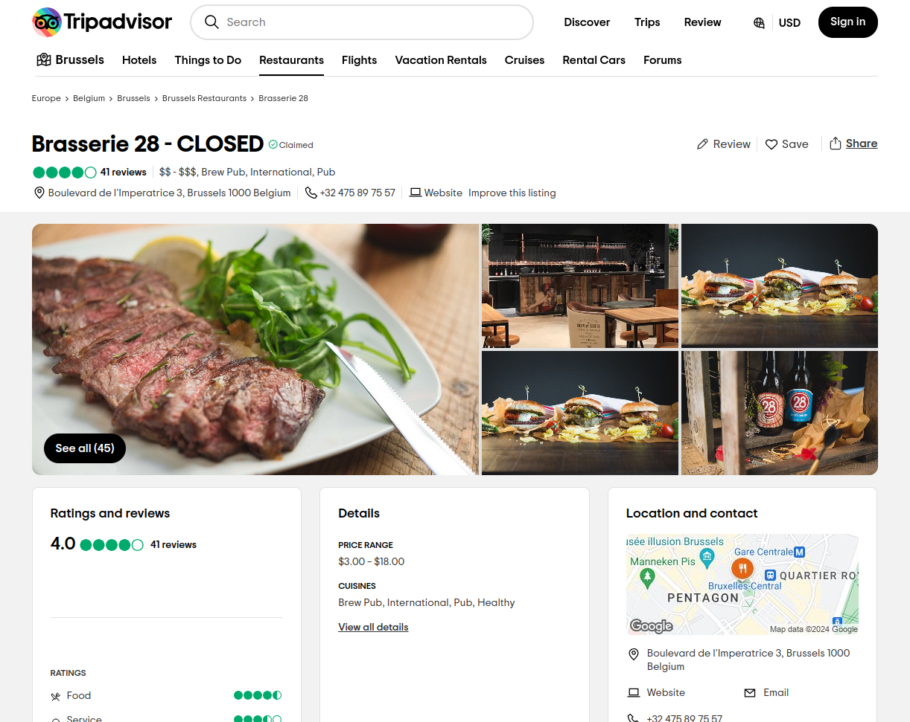
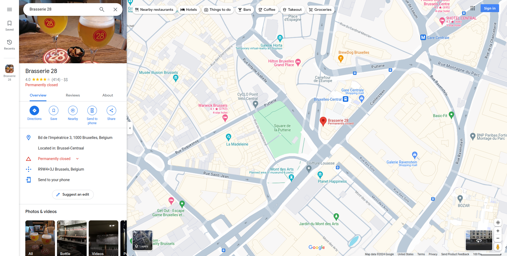
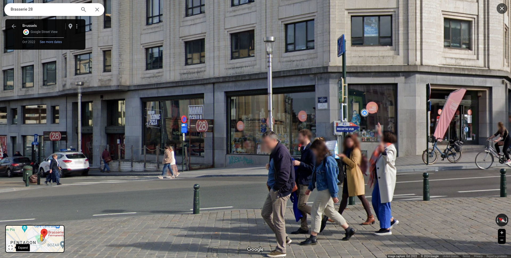
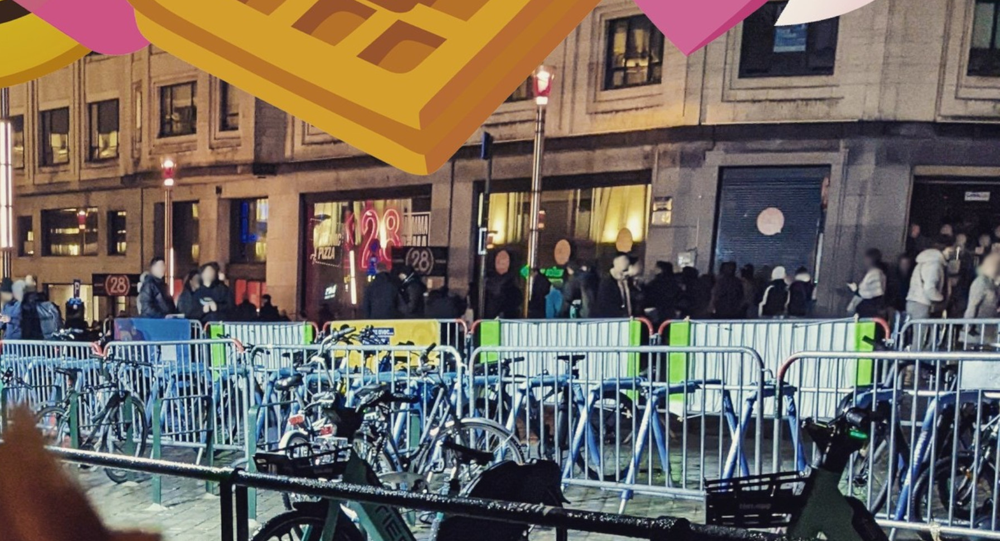

# stalknights_2

## Difficulty

Medium

## Points Earned 

802

## Description

> **starknight1337** shared another photo on their Instagram. What is the name of the park where the photo was taken?
> 
> Flag format: `jellyCTF{name_of_park}` (all lowercase)
> 
> Author: Sheepiroo
> 
> Note: If a link/image asks for login, try opening it in a new tab to bypass login.

## Solution

Just like [stalknights_1](./stalknights_1.md), we can inspect element on the picture to get a higher resolution.

Reverse image searching doesn't give us useful results, but if we zoom into the picture we can get some clues as to where this picture was taken.

When we search "bright festival" and head to images:

So now we know that this is somewhere in Brussels. Let's look at the image again for another clue.

"Pizza," and "28." Let's see what Google shows us.

That last result looks interesting.

That logo is a match. Let's see where this place is on Google Maps.

I see a park there called [Square de la Putterie](https://maps.app.goo.gl/CNfg6hhMds9YNfXd7), but let's just make sure we're in the right place.

[stalknights 2 comparison](https://github.com/OtherAndrew/jellyCTF-writeups/assets/103388958/bbb3fbf8-7d72-4ea1-ad69-41bd81a7eb24 "stalknights_2 comparison")

## Flag

`jellyCTF{square_de_la_putterie}`
