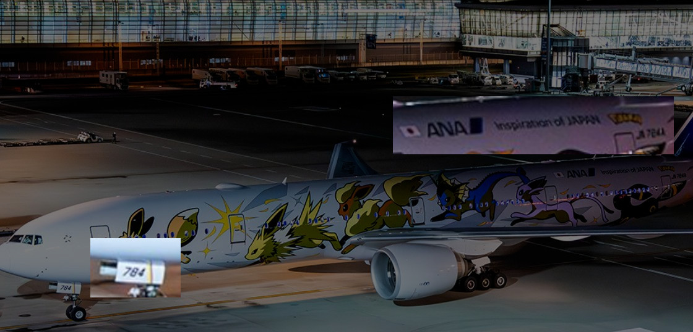
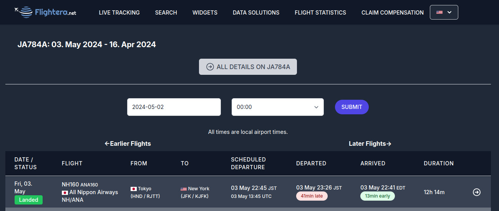

# stalknights_3

## Difficulty

Medium

## Points Earned 

626

## Description

> > Hmm, I wonder where this starknight is from...
>
> Find the city and country where this starknight lives.
>
> Flag format: `jellyCTF{name_of_city,name_of_country}`
>
> Note: This challenge **does not** required paid services and can be done only using free tools
> 
> Author: Sheepiroo

## Solution

Jelly did this one on stream ([28:10](https://www.youtube.com/live/QH8LKkIVHzI?t=1690)):

starknight1337 has a link to [their Twitter profile](https://twitter.com/starknight1337) on [their Instagram](https://www.instagram.com/starknight1337/).

When we scroll down we land on [this post](https://twitter.com/starknight1337/status/1788584687532970045):

So they were at an airport on May 3rd, 2024. Let's see if we can find out more by looking at the image.

We can download a higher resolution version of the image by heading to https://pbs.twimg.com/media/GNJUBb_aQAAOLzu.jpg?name=orig.

So this is an ANA plane, number 784. Let's google "784 pokemon plane:"

Now let's look up [where JA784A was on May 3rd](https://www.flightera.net/en/planes/JA784A/2024-05-03%20%2000_00):

Link to the flight information: https://www.flightera.net/en/flight_details/All+Nippon+Airways/NH160/RJTT/2024-05-03

## Flag

`jellyCTF{new_york,usa}`