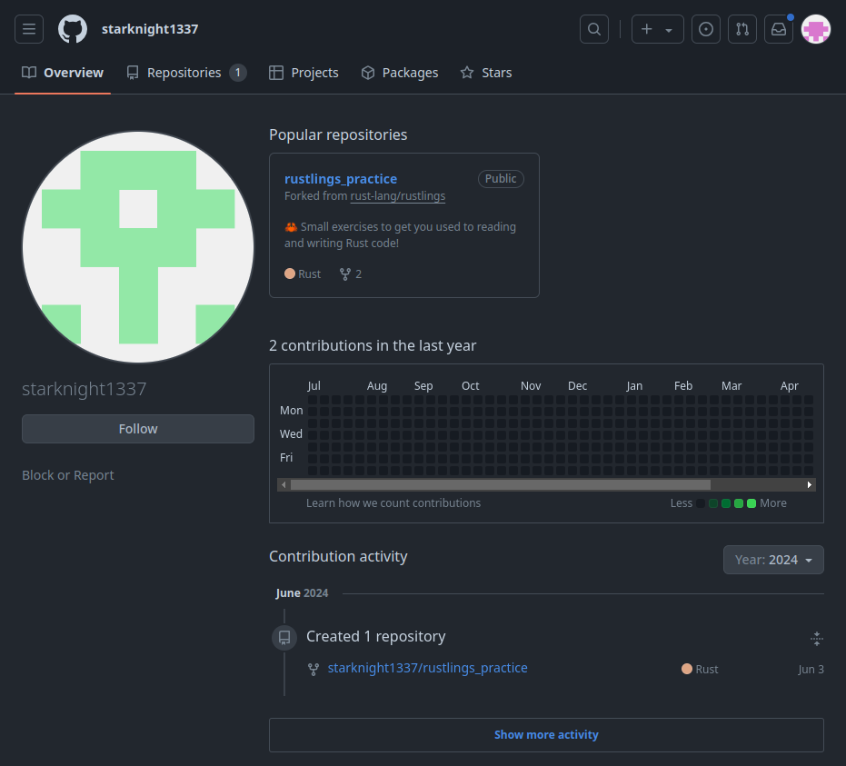
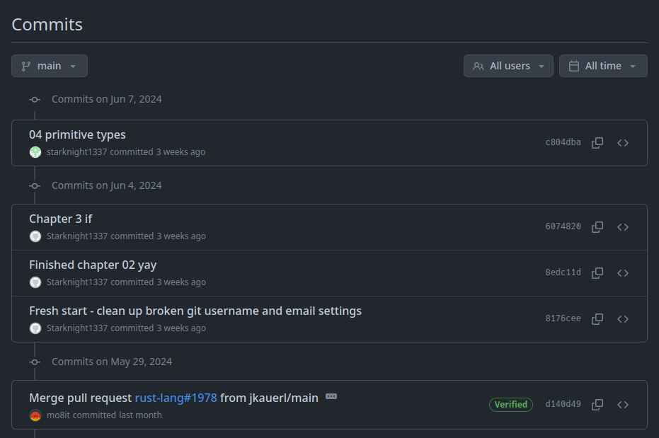
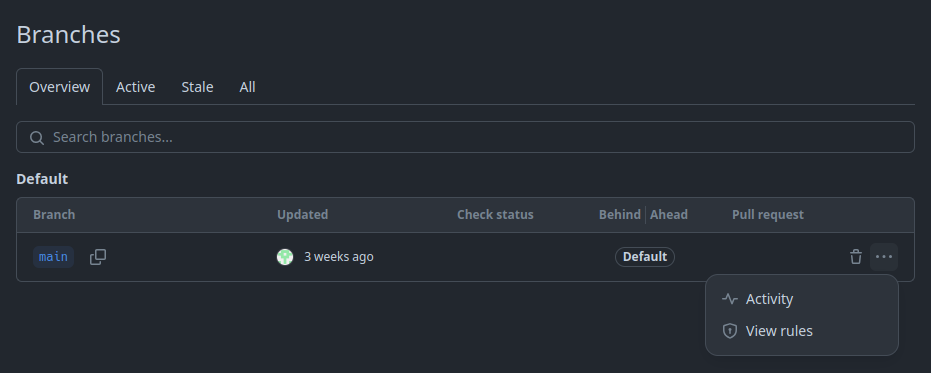
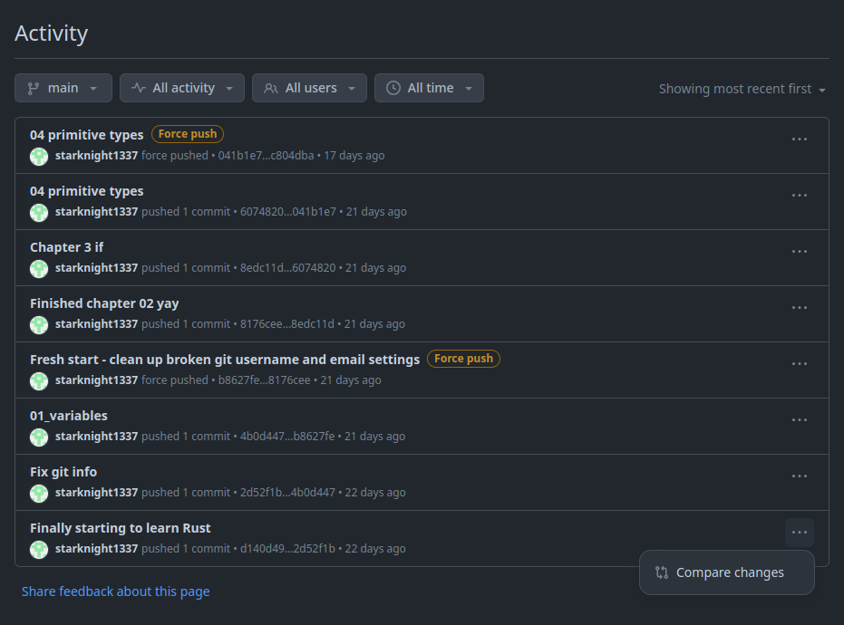
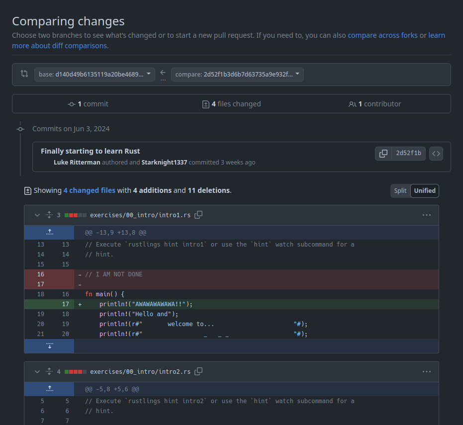

# stalknights_4

## Difficulty

Medium

## Points Earned 

887

## Description

> What is the real name of this starknight?
> 
> 15 point hint: Search keywords
> 
> Flag format: `jellyCTF{firstname_lastname}`
> 
> Author: Sheepiroo

## Solution

starknight1337 has a link to [their Twitter profile](https://twitter.com/starknight1337) on [their Instagram](https://www.instagram.com/starknight1337/).

Their latest post suggests that they have a GitHub account, and they have something revealing in their commit history. When we head over to https://github.com/starknight1337:

Let's look at that [`rustlings_practice`](https://github.com/starknight1337/rustlings_practice) repo.

There's nothing revealing when we look at each of these commits, so I got stuck. I decided to unlock the hint.

### Hint
> Search keywords: force push history

Looking up how to see GitHub force push history gave me some git commands that didn't really work, but I eventually stumbled upon some [GitHub documentation](https://docs.github.com/en/enterprise-server@3.11/repositories/viewing-activity-and-data-for-your-repository/using-the-activity-view-to-see-changes-to-a-repository) that described how to use the activity view to see changes to a repository.

When we head to the [branches](https://github.com/starknight1337/rustlings_practice/branches) page of the repo:

And click the `Activity` button:

Now we see every commit starknight1337 has made to this repo. Let's compare changes on the first one.

## Flag

`jellyCTF{luke_ritterman}`