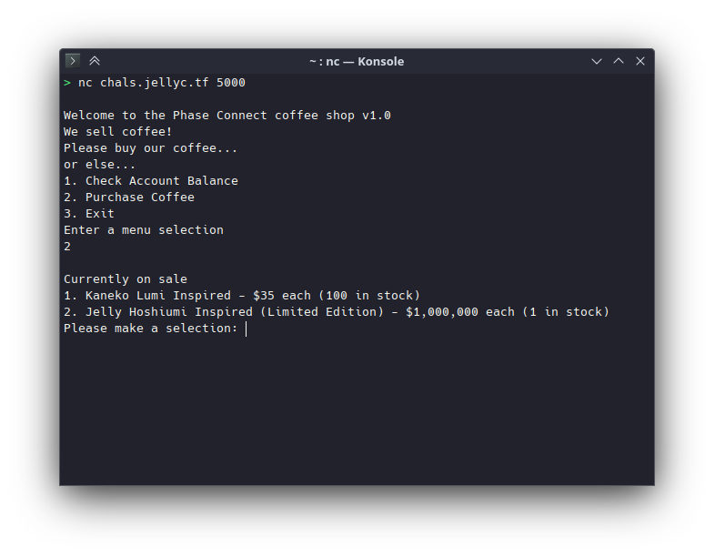
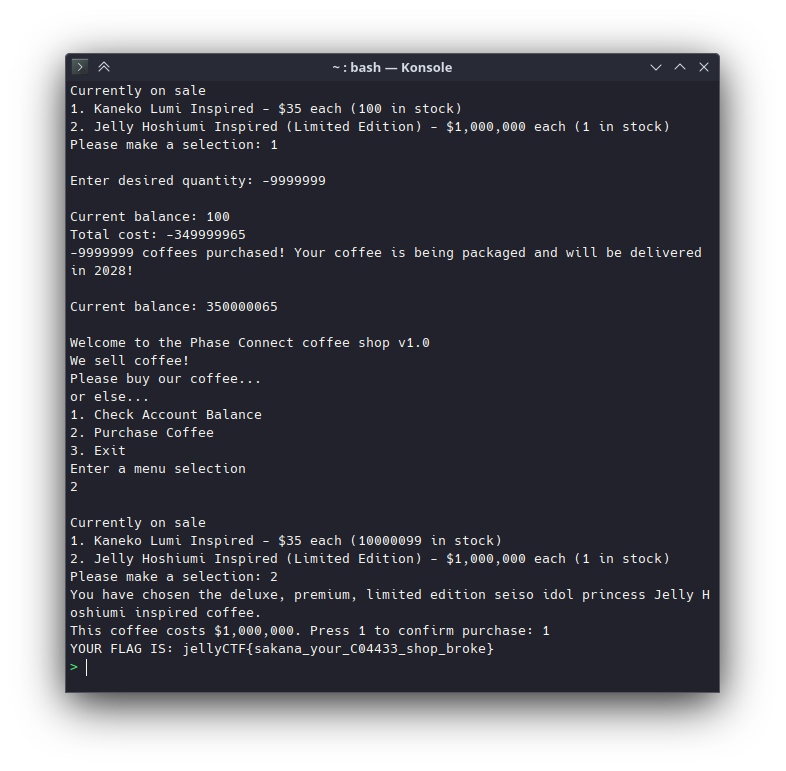

# phase_coffee_1

**Difficulty**: Easy

**Points earned**: 296

**Description**:

> > **Phase Connect Coffee Shop**
> > 
> > Limited Jelly Hoshiumi coffee for sale now!
> > 
> > -- insert Jelly coffee description here --
> 
> I really gotta get my balance up for this... maybe I should try meal replacements
> 
> This challenge is part 1 out of 3 challenges.
> 
> Completing this challenge will unlock 1 challenge.
> 
> Author: Sheepiroo
> 
> `nc chals.jellyc.tf 5000`

**Solution**: 

You're gonna need [netcat](https://en.wikipedia.org/wiki/Netcat) for this one. I unlocked both hints before figuring this out.

Hint 1:

> How is `coin_balance` calculated? Is there any way to make it go bigger?

Hint 2:

> The input `quantity` is not validated properly - are there any unexpected values that could be used?

We need to increase our balance enough to buy Jelly's coffee. Buying negative amounts of coffee will increase our balance. 

**Flag**: `YOUR FLAG IS: jellyCTF{sakana_your_C04433_shop_broke}`