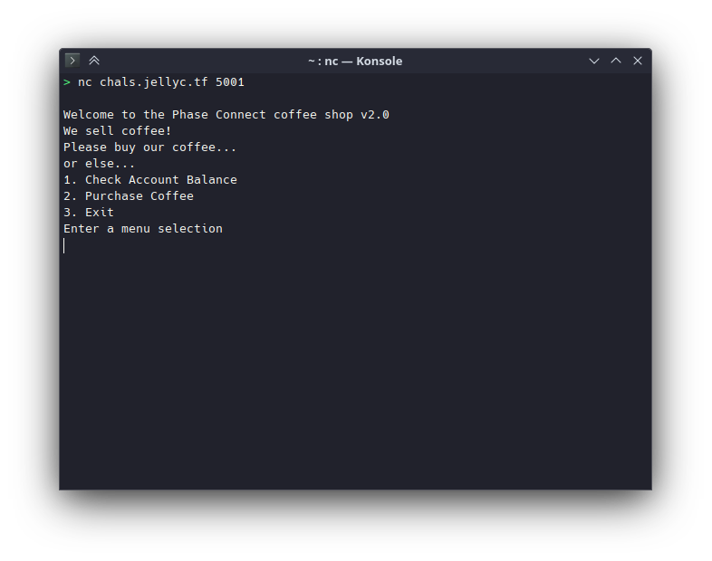

# phase_coffee_2

## Difficulty

Medium

## Points Earned

487

## Description

> Surely all the bugs have been fixed...
> 
> This challenge is **part 2** out of 3 challenges.
> 
> Completing this challenge will unlock 1 challenge.
> 
> Author: Sheepiroo
> 
> `nc chals.jellyc.tf 5001`



## Solution

Buying negative coffee doesn't work anymore. I needed all 3 hints for this one.

### Hint 1

> The data type of `coin_balance` is relevant

### Hint 2

> Integer underflow

So I know what integer underflow is, but not what the magic number was.

### Hint 3

> A 32-bit integer has a minimum value of `-(2^31) = -2147483648`. Subtracting further will cause `coin balance` to underflow to a large positive number. How many coffees do you need to buy for this to happen?

```
(2147483648 + 100) / 35 = 61356678 + 18/35 ≈ 61356678.51
```

We need to order 61356678 + 1 bags of coffee.


## Flag

`jellyCTF{dud3_y0u_m1ss3d_4n0th3r_bug}`