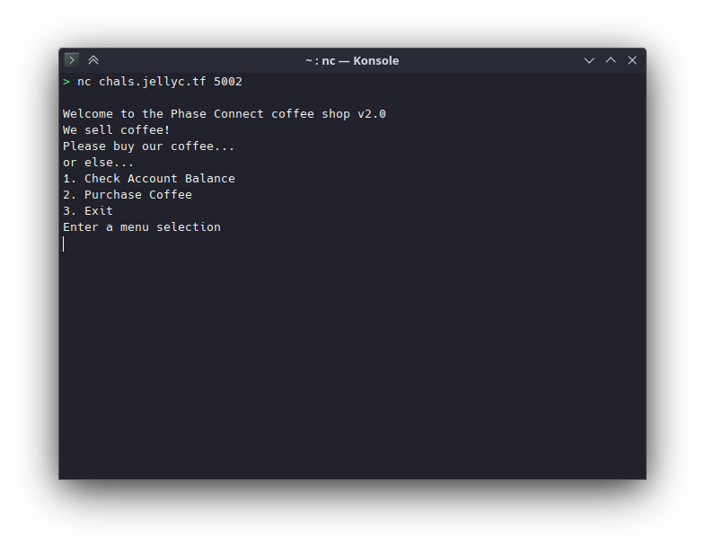
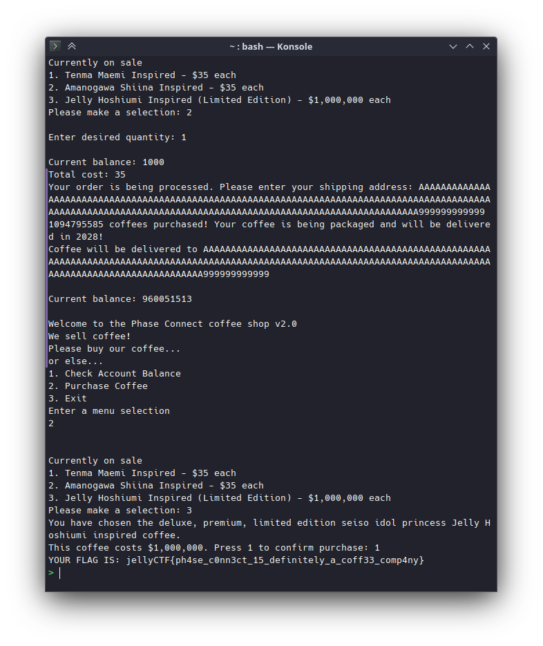

# phase_coffee_3

## Difficulty

Easy

## Points Earned

643

## Description

> Fine.. NOW all the bugs have been fixed.
> 
> Huh? There's complaints that customers have not received their orders?
> 
> Hmm... maybe the shop should have asked for a shipping address. Anyway, that's also fixed now!
> 
> This challenge is the final challenge in a series of 3 challenges.
> 
> Author: Sheepiroo
> 
> `nc chals.jellyc.tf 5002`



## Solution

Had to buy a hint:

> Buffer overflow on `address` to overwrite value of coin balance

Basically we need to input a string for address long enough that it overflows and overwrites the coin balance. This is the string I used:

```
AAAAAAAAAAAAAAAAAAAAAAAAAAAAAAAAAAAAAAAAAAAAAAAAAAAAAAAAAAAAAAAAAAAAAAAAAAAAAAAAAAAAAAAAAAAAAAAAAAAAAAAAAAAAAAAAAAAAAAAAAAAAAAAAAAAAAAAAAAAAAAAAAAAAAAAAAAAAAAAA999999999999
```



## Flag

`jellyCTF{ph4se_c0nn3ct_15_definitely_a_coff33_comp4ny}`