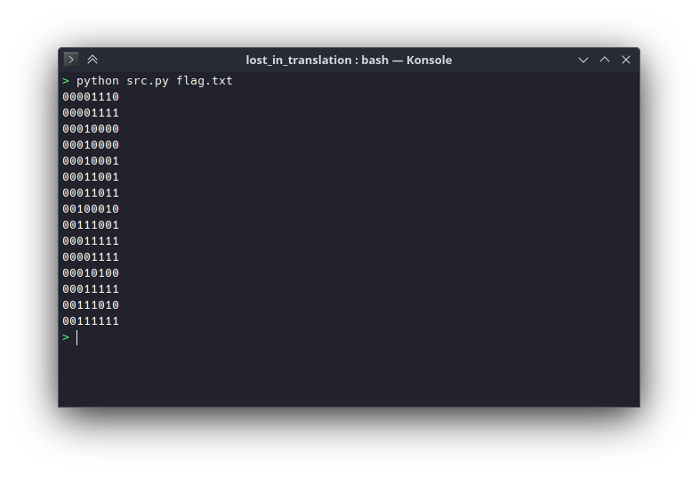
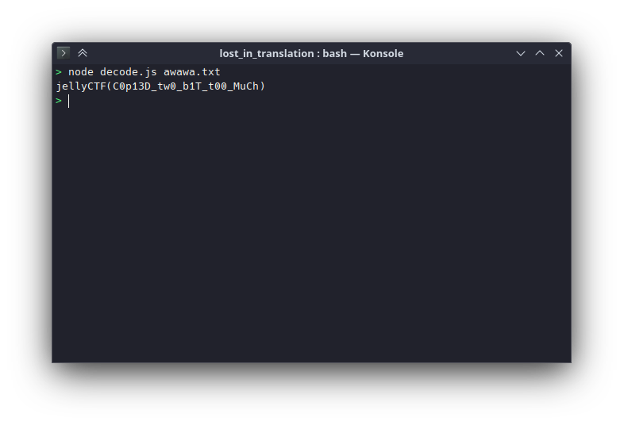

# lost_in_translation

## Difficulty

Easy

## Points Earned 

676

## Description

> So I tried making an AwaSCII translator to help with writing Awatalk, but I don't really know python so I just copied some code off the internet. The output looks fine on first glance, but when I try to use it, it doesn't work. Can you help me figure out what's wrong with it?
>
> Due to technical limitations with AwaSCII, the flag format for this challenge is jellyCTF(awawawa)
>
> Author: kuuhaku0989

We are given two files:

[`awawa.txt`](./media/awawa.txt) [`src.py`](./media/src.py)

## Solution

I don't know Python so I wrote my own [encoder](./media/encode.js)/[decoder](./media/decode.js) in JavaScript to see how it *should* work. Using my decoder to decode `awawa.txt` didn't work, but I noticed something while messing around with the original `src.py` decoder. When I printed out the ASCII-binary conversion result, each binary code was 8 bits long.

```py
# convert code into binary (copied this off of stackoverflow)
binary_awascii = format(awascii_code, '#010b')[2:]
print(binary_awascii)
```



The problem here is that according to the [AWA 5.0 spec](https://github.com/TempTempai/AWA5.0/blob/main/Documentation/AWA5.0%20Specification.pdf), each character is represented by 6 bits, not 8. Using my decoder with 8 bits, I got this result:



## Flag

`jellyCTF{C0p13D_tw0_b1T_t00_MuCh}`