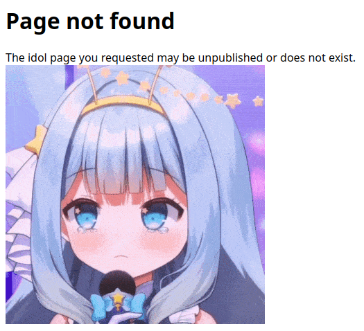

# aidoru

**Difficulty**: Easy

**Points earned**: 343

**Description**:

```
Phase Connect is full of seiso idols!
Note: Volume warning

There's a hidden flag on Jelly's page, but the creator hasn't made her page public yet. Can you find a way to access her page and capture the flag?

10 point hint: Main method
25 point hint: Tool to use

Author: Sheepiroo

https://aidoru.jellyc.tf/
```


**Solution**: 

Clicking on Jelly's picture takes us to a 404 page.



I had to unlock both hints for this one.

Hint 1:

```
Perhaps there's a way to crack the profile IDs and find out how they're generated, so we can make one for our princess
```

Hint 2:

```
Try a hash cracking tool

- hashcat
- https://crackstation.net/ (site down)
- https://hashes.com/en/decrypt/hash
```

By examining the website source, I saw that each image links to `/covers/[some hash]`. I took Rie's hash (`41895503f71f59ce931bd3590c577b3c`) and put it into https://www.dcode.fr/hash-function, which told me that it decoded to `rie` with MD5.

Encoding `jelly` with MD5 gives me `328356824c8487cf314aa350d11ae145`. This is what we see when we go to https://aidoru.jellyc.tf/covers/328356824c8487cf314aa350d11ae145:


When I opened up the Elements tab in Chrome devtools:


**Flag**: `jellyCTF{u_r_the_p3rfect_ultimate_IDOR}`