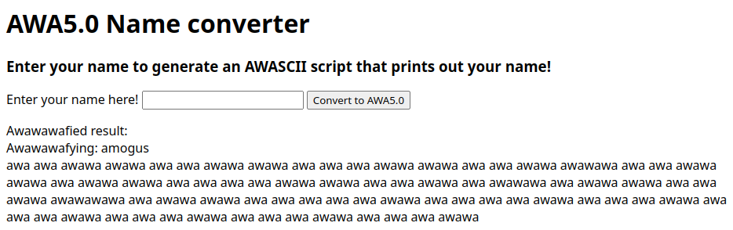
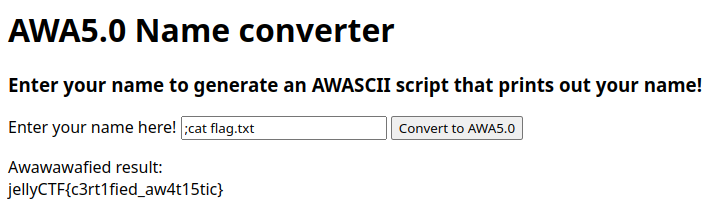

# awafy_me

## Difficulty

Easy

## Points earned

553

## Description

> Hacked this together for Jelly's mutually beneficial partnership application
>
> Author: Sheepiroo
> 
> https://awafy-me.jellyc.tf/

## Solution

I unlocked the hint for this one:

> > Note: Read the Security Considerations section before using `shell=True`.
> 
> Well that sign can't stop me because I can't read!
> 
> https://docs.python.org/3/library/subprocess.html#security-considerations

I looked up [how to do shell injection](https://en.wikipedia.org/wiki/Code_injection#Shell_injection) and put `;cat flag.txt` into the text box:

## Flag

`jellyCTF{c3rt1fied_aw4t15tic}`